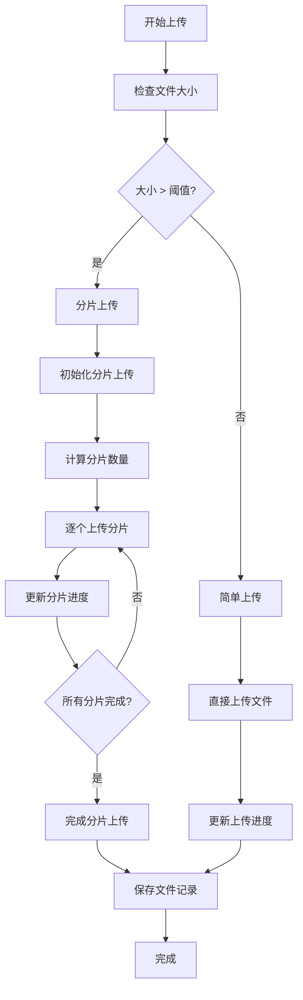
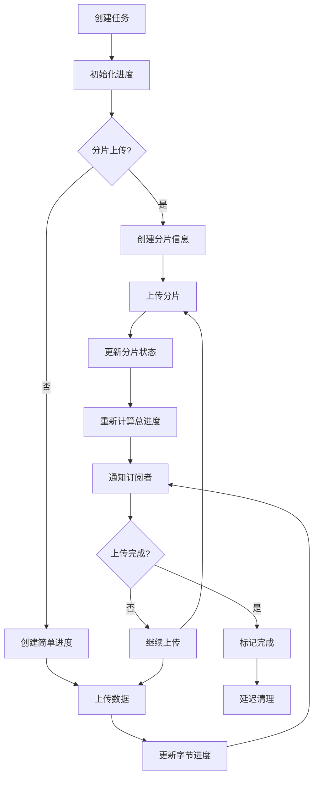

# 分片上传功能详解

## 📋 概述

本文档详细描述了OSS Manager后端的智能分片上传功能。系统会根据文件大小自动选择最适合的上传方式：小文件使用简单上传，大文件使用分片上传，从而提高上传效率和稳定性。

## 🏗️ 架构设计

### 核心组件

1. **Upload Manager** (`internal/upload/manager.go`)
   - 负责进度追踪和状态管理
   - 支持简单上传和分片上传的进度监控
   - 提供实时进度推送能力

2. **OSS File Handler** (`internal/api/handlers/oss_file.go`)
   - 智能选择上传方式
   - 处理分片上传逻辑
   - 整合进度追踪功能

3. **Storage Interface** (`internal/oss/interface.go`)
   - 定义统一的存储接口
   - 支持多种云存储服务
   - 抽象分片上传操作

## ⚙️ 功能特性

### 智能上传选择

- **自动判断**: 根据文件大小自动选择上传方式
- **灵活配置**: 支持自定义分片阈值和分片大小
- **统一接口**: 对前端提供统一的上传接口

### 详细进度追踪

- **实时进度**: 提供准确的上传进度百分比
- **速度监控**: 实时计算和显示上传速度
- **分片状态**: 分片上传时显示每个分片的状态
- **状态管理**: 支持上传中、完成、失败等状态

### 强健的错误处理

- **失败重试**: 单个分片失败时自动重试
- **状态恢复**: 通过 `X-Upload-Id` 头部支持断点续传
- **资源清理**: 失败时自动清理临时资源

## 🔧 API接口

### 1. 统一上传接口

#### 表单上传
```http
POST /api/v1/oss/files
Content-Type: multipart/form-data
Authorization: Bearer <token>
region_code: cn-hangzhou
bucket_name: test-bucket
X-Chunk-Threshold: 104857600  # 分片阈值(字节)，默认100MB
X-Chunk-Size: 10485760        # 分片大小(字节)，默认10MB
X-Chunk-Concurrency: 3        # 并发上传分片数，可选
Upload-Task-ID: <uuid>        # 可选，用于进度追踪

file: <binary_data>
```

#### 流式上传
```http
POST /api/v1/oss/files
Content-Type: application/octet-stream
Authorization: Bearer <token>
region_code: cn-hangzhou
bucket_name: test-bucket
X-File-Name: example.zip
Content-Length: 157286400
X-Chunk-Threshold: 104857600
X-Chunk-Size: 10485760
X-Chunk-Concurrency: 3
Upload-Task-ID: <uuid>
X-Upload-Id: <upload_id>      # 可选，用于断点续传
X-Object-Key: <object_key>    # 与 X-Upload-Id 一同使用

<binary_data>
```

### 2. 分片上传接口（手动控制）

#### 初始化分片上传
```http
POST /api/v1/oss/multipart/init
Content-Type: application/json
Authorization: Bearer <token>

{
    "region_code": "cn-hangzhou",
    "bucket_name": "test-bucket",
    "file_name": "large-file.zip"
}
```

**响应:**
```json
{
    "success": true,
    "data": {
        "upload_id": "upload-id-123",
        "object_key": "user123/20231215/abc123.zip",
        "urls": [
            "https://presigned-url-1",
            "https://presigned-url-2",
            "..."
        ]
    }
}
```

#### 完成分片上传
```http
POST /api/v1/oss/multipart/complete
Content-Type: application/json
Authorization: Bearer <token>

{
    "region_code": "cn-hangzhou",
    "bucket_name": "test-bucket",
    "object_key": "user123/20231215/abc123.zip",
    "upload_id": "upload-id-123",
    "parts": ["etag1", "etag2", "etag3"],
    "original_filename": "large-file.zip",
    "file_size": 157286400,
    "task_id": "task-uuid-123"
}
```

#### 取消分片上传
```http
DELETE /api/v1/oss/multipart/abort
Content-Type: application/json
Authorization: Bearer <token>

{
    "config_id": "config-id-123",
    "object_key": "user123/20231215/abc123.zip",
    "upload_id": "upload-id-123"
}
```

#### 查询已上传分片
```http
GET /api/v1/oss/multipart/parts?region_code=cn-hangzhou&bucket_name=test-bucket&object_key=user123/20231215/abc123.zip&upload_id=upload-id-123
Authorization: Bearer <token>
```

**响应:**
```json
{
    "success": true,
    "data": {
        "parts": [1, 2, 3]
    }
}
```

### 3. 进度查询接口

#### 获取进度快照
```http
GET /api/v1/uploads/{task_id}/progress
```

**响应:**
```json
{
    "success": true,
    "data": {
        "total": 157286400,
        "uploaded": 78643200,
        "percentage": 50.0,
        "speed": 5242880,
        "start_time": "2023-12-15T10:00:00Z",
        "update_time": "2023-12-15T10:01:30Z",
        "is_chunked": true,
        "total_chunks": 15,
        "chunks": [
            {
                "chunk_number": 1,
                "chunk_size": 10485760,
                "uploaded": true
            }
        ],
        "status": "uploading"
    }
}
```

#### SSE实时进度流
```http
GET /api/v1/uploads/{task_id}/stream
Accept: text/event-stream
```

**响应流:**
```
data: {"total":157286400,"uploaded":10485760,"percentage":6.7,"speed":5242880,"is_chunked":true,"status":"uploading"}

data: {"total":157286400,"uploaded":20971520,"percentage":13.3,"speed":5242880,"is_chunked":true,"status":"uploading"}

data: {"total":157286400,"uploaded":157286400,"percentage":100.0,"speed":0,"is_chunked":true,"status":"completed"}
```

## 🎯 工作流程

### 智能上传流程



### 进度追踪流程



## 📊 配置参数

### 上传配置

| 参数 | 类型 | 默认值 | 说明 |
|------|------|--------|------|
| `X-Chunk-Threshold` | int64 | 104857600 (100MB) | 分片上传阈值 |
| `X-Chunk-Size` | int64 | 10485760 (10MB) | 分片大小 |
| `X-Chunk-Concurrency` | int | 配置值或1 | 并发上传的分片数 |
| `Upload-Task-ID` | string | auto-generated | 任务ID，用于进度追踪 |

### 系统配置

| 配置项 | 默认值 | 说明 |
|--------|--------|------|
| Progress cleanup delay | 5秒 | 进度信息保留时间 |
| Upload timeout | 30秒/分片 | 单个分片上传超时 |
| Max concurrent uploads | 配置值或1 | 最大并发上传数 |

## 🧪 测试方法

### 使用测试脚本

项目提供了完整的分片上传测试脚本 `test/shell/multipart_upload_test.sh`：

```bash
# 基本测试（自动创建测试文件）
./test/shell/multipart_upload_test.sh

# 使用指定文件测试
./test/shell/multipart_upload_test.sh -f /path/to/large-file.zip

# 自定义配置测试
./test/shell/multipart_upload_test.sh -t 50 -c 5 -f /path/to/file.pdf

# 查看帮助
./test/shell/multipart_upload_test.sh -h
```

### 手动测试步骤

1. **准备测试文件**
   ```bash
   # 创建100MB测试文件
   dd if=/dev/urandom of=test_100mb.bin bs=1M count=100
   ```

2. **获取认证token**
   ```bash
   TOKEN=$(curl -s -X POST "http://localhost:8080/api/v1/auth/login" \
     -H "Content-Type: application/json" \
     -d '{"username":"admin","password":"admin123"}' | \
     jq -r '.data.token')
   ```

3. **测试上传**
   ```bash
   # 生成任务ID
   TASK_ID=$(uuidgen)
   
   # 上传文件
   curl -X POST "http://localhost:8080/api/v1/oss/files" \
     -H "Authorization: Bearer $TOKEN" \
     -H "region_code: cn-hangzhou" \
     -H "bucket_name: test-bucket" \
     -H "X-Chunk-Threshold: 52428800" \
     -H "Upload-Task-ID: $TASK_ID" \
     -F "file=@test_100mb.bin"
   ```

4. **监控进度**
   ```bash
   # 查询进度
   curl "http://localhost:8080/api/v1/uploads/$TASK_ID/progress"
   
   # SSE实时流
   curl -N "http://localhost:8080/api/v1/uploads/$TASK_ID/stream"
   ```

## 🔍 性能优化

### 分片大小选择

- **小文件** (< 100MB): 建议使用简单上传
- **中等文件** (100MB - 1GB): 分片大小 10-20MB
- **大文件** (> 1GB): 分片大小 20-100MB

### 并发控制

- 分片上传支持并发，可通过 `chunk_concurrency` 配置或 `X-Chunk-Concurrency` 头设置并发数
- 进度通知使用非阻塞channel，防止阻塞上传
- 适时的垃圾回收，防止内存泄漏

### 网络优化

- 支持传输加速域名
- 自动重试机制
- 连接池复用

## 🚨 错误处理

### 常见错误类型

1. **网络错误**: 自动重试，最多3次
2. **认证错误**: 立即返回，要求重新认证
3. **存储空间错误**: 立即返回，检查配置
4. **文件大小错误**: 参数验证失败

### 故障恢复

- 分片上传失败时自动清理临时资源
- 进度信息异常时自动重置
- 支持手动中止上传任务

## 📈 监控指标

### 关键指标

- 上传成功率
- 平均上传速度
- 分片失败率
- API响应时间

### 日志记录

系统会记录详细的上传日志，包括：
- 上传开始/结束时间
- 文件大小和分片信息
- 错误信息和堆栈
- 性能指标

## 🔮 未来计划

### 短期计划

- [ ] 断点续传支持
- [ ] 批量上传优化
- [ ] 更多云存储支持

### 长期计划

- [ ] 智能分片大小算法
- [ ] 分布式上传调度
- [ ] 机器学习优化

## 📞 技术支持

如有问题或建议，请：
1. 查看项目文档
2. 检查日志文件
3. 提交Issue
4. 联系技术团队

---

*最后更新: 2023年12月15日* 